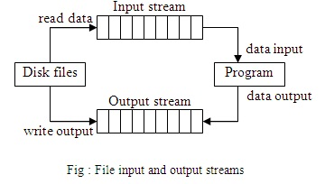
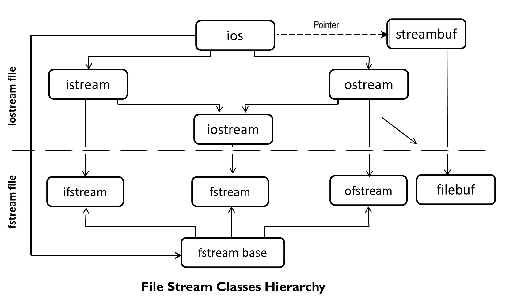
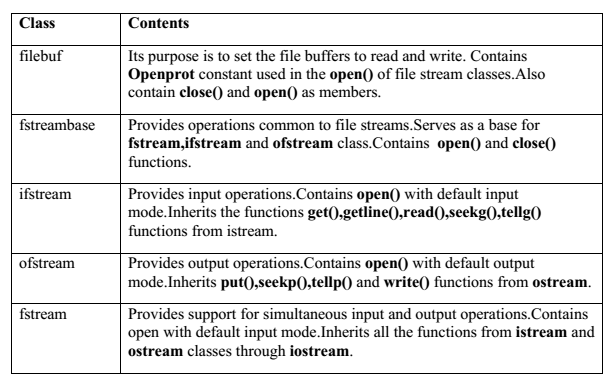

# File Processing


The input operation involves the creation of an `input stream` and linking it with the program and the input file. Similarly, the output operation involves establishing an `output stream` with the necessary links with the program and the output file.

## Classes for File Stream Operations



## Opening and Closing a File



for opening a file, we must first create a `file stream` and then link it to the filename. A file can be opened in two ways:
1. Using the constructor function of the class. This is useful when we use only one file in the stream.
2. Using the member function `open()` of the class. This is used when we want to manage multiple files using one stream.

### Opening Files using Constructor

`ofstream outfile("results");` Opens a file named `results` for output. This creates `outfile` as an `ofstream` object that manages the output stream. 

`ifstream infile("data");` Opens the file `data` for reading (input). It declares `infile` as an `ifstream` object and attaches the `data` file for reading.

**Example**
```
ofstream outfile("salary"); // Creates outfile and connects salary to it.

ifstream infile("salary"); // Creates infile and connects salary to it.
```

The connection with a file is closed automatically when the `stream object` expires (program terminates). another way `outfile.close()` and `infile.close()` also disconnects the connection.

```
#include<iostream>
#include<fstream>

using namespace std;

int main()
{
    ofstream outf("ITEM");  // connect ITEM file to outf. It will create a file if not present.

    cout << "Enter Item Name: ";
    char name[30];
    cin >> name;    

    outf << name << endl;

    cout << "Enter Item Cost: ";
    float cost;
    cin >> cost;

    outf << cost << endl;
    
    outf.close();

    ifstream inf("ITEM");   // Connects ITEM file to inf
    
    inf >> name;
    inf >> cost;

    cout << endl;
    cout << "Item name: " << name << endl;
    cout << "Item Cost: " << cost << endl;

    inf.close();
    return 0;
}
```

