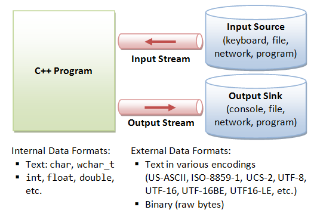

# Streams and File Processing
C++ uses the concept of `stream` and `stream classes` to implement its IO operations with the console and disk files.

## C++ Streams
The I/O system supplies an interface to the programmer that is independent of the actual device being accessed. This interface is known as `stream`.

A `stream` is a sequence of bytes. It acts either as a `source` from (`input stream`) which the input data can be obtained or as a `destination` to which (`output stream`) the output data can be sent. 



`cin` and `cout` represents the input stream (usually the keyboard) and output stream (usually the screen) respectively. These keyboard and screen are default options. `We can redirect streams to other devices or files, if necessary`. 

## C++ Stream Classes


`ios` is the base class. It is declared as the `virtual base class` so that only one copy of its members are inherited by the `iostream`. It provices the basic support for formatted and unformatted I/O operations. 

## Unformatted I/O Operations

`cin` and `cout` are used for various data types. This is possible by overloaded operators `>> and <<`. The `>>` is overloaded in the `istream` class and `<<` is overloaded in the `ostream` class. 

``` 
cin >> var1 >> var2 >> var3 >> var4;
cout << item1 << item2 << itmeN;
```

### put() and get() Functions
The classes `istream` and `ostream` define two member functions `get()` and `put()` respectively. These functions are used to handle `single character` I/O operatins.

**get**
we can use both `get(char *)` and `get(void)` prototypes to fetch a character including the `blank spaces, tab and newline character`.

Example:
```
char c
cin.get(c);
while(c != '\n')
{
    cout << c;
    cin.get(c);  
    // or
    c = cin.get();
}
```

**put**
It is used to output a line of text, character by character.

Example:
```
cout.put('x');
cout.put(ch);
```

### getline() and write() Functions
These functions can be used to read and display a line of text. 

**getline**

The `getline()` function reads a whole line of text that ends with a newline character. This resolves the issue of `\n` character wiht `cin`.

`cin.getline(line,size);`

```
char name[20];
cin.getline(name, 20)
```

**write**

The `write()` function displays an entire line and has the following form: `cout.write(line,size)`.

Example:

```
cout.write("hello", 5);
```

```Note: It is possible to concatenate two strings using wrtie() function```
cout.write(string1, m).write(string2, n);

## Formatted Console I/O Operations
The following features of C++ can be used for Formatting the output:
* `ios` class functions and flags.
* Manipulators
* User-defined output functions

### ios format functions
Ther are many:
* `width()`:
* `precision()`:
* `fill()`:
* `setf()`:
* `unsetf()`:

`Manipulators` are special functions that can be included in the I/O statements to alter the format parameters of a stream.

(Put images here)