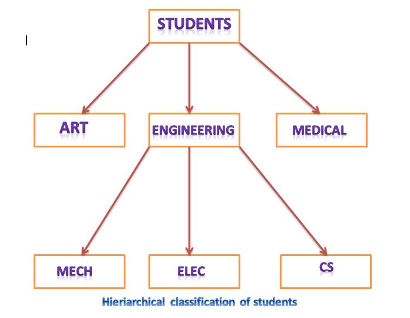
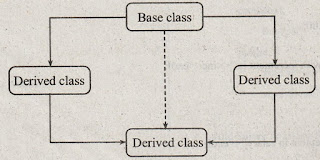

# More on inheritance

## Multilevel Inheritance
The class A serves as a bse class for thederived class B, which in turn serves as a base class for the derived class C. The chain `ABC` is known as inheritance path.

### Example
```
class A{...};   // Base Class
class B: public A {.....};  // B derived from A
class C: public B {.....}; // C derived from B
```

The above mentioned process can be extended to any number of levels.

## Multiple Inheritance
A class can inherit the attributes of two or more classes. This is known as `multiple inheritance`. It allows us to combine the features of several existing classes as a starting point for defining new classes. It is like a child inheriting the physical features of one parent and the intelligence of another.

**Syntax**
```
class D: visibility B-1, visibility B-2 ...
{
    .....
    .....
};
```

## Hierarchical Inheritance
It is used to support the `hierarchical` design of a program. Many programming problems can be cast into a hierarchy where certain feature of one level are shared by many other below that level.



## Hybrid Inheritance
This contains two or more types of inheritance to design a program.


## Virtual Base Classes
If we combine different types of inheritance then the following situation can arise (as shown in figure). This is termed as `multi path inheritance`. 


This kind of situation pose some problems. All the public and protected members of the `Base Class` will be inherited into the final class `twice`. This introduces `ambiguity` and should be avoided. 

This mulipath problem can be avoided by making the common base clas as `virtual base class` while declaring the direct or intermediate base classes.

### Example
```
class A
{
    ....
    ....
};

class B1: virtual public A
{

};

class B2: public virtual A
{

};

class C: public B1, public B2
{

};
```

## Abstract Classes
