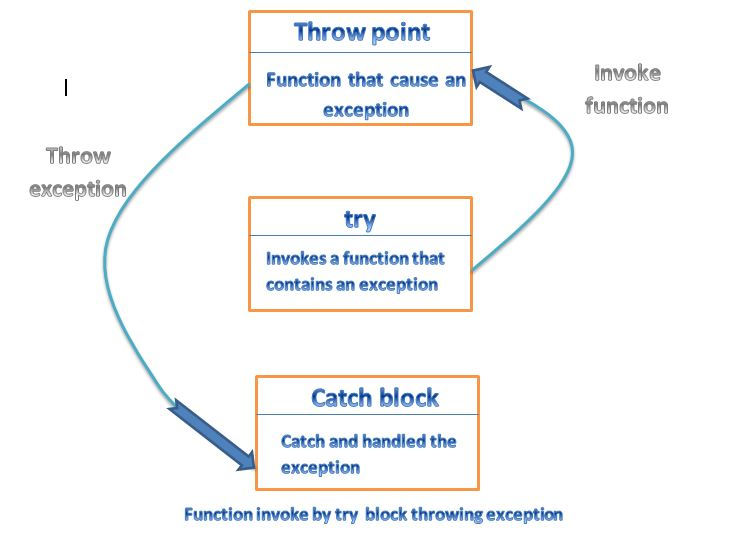

# Exception Handeling
* `Synchronous exceptions`: such as `out-of-range index` and `over-flow`
* `Asynchronous exceptions` : The errors that are caused by events beyond the control of the program (such as keyboard interrupts) are called `asynchronous exceptions`.

The exception handling mechanism in `C++` is designed to handle only `synchronous exceptions` only.

## Exception Handling Mechanism

**syntax**

```
try
{
    .....
}

catch (type arg)
{
    ....
}
```

exceptions are objects used to transmit information about a problem. If the type of object throws matches the `arg` type is the catch staement, then catch block is executed for handling the exception. If they do not match, the program is aborted with the help of the `abort()` function which is invoked by default. 

**Example**

```
#include <iostream>

using namespace std;

int main()
{
    int a, b;
    cout << "Enter values of a and b " << endl;
    cin >> a;
    cin >> b;
    int x = a - b;
    try
    {
        if (x != 0)
        {
            cout << "Result (a/x) = " << a/x << endl;
        }
        else
        {
            throw(x);
        }
    }
    catch(int i)
    {
        cout << "Exception caught: x = " << x << "\n";
    }

    return 0;
}
```

The point at which the `throw` is executed is called the `throw point`. 




**General format of Code**
```
type function(arg list)
{
    ....
    throw(object);
}
try
{
    ....
    // invoke function here
}
catch(type arg)
{
    .....
    // handle exception here
}
```

`Note`: The `try` block is immediately followed by the `catch` block, irrespective of the location of the `throw point`.

**Example**
```
#include<iostream>
using namespace std;

void divide(int x, int y, int z)
{
    cout << "\n We are inside the function \n";
    if((x - y) != 0)
    {
        int R = z/(x - y);
        cout << "Result = " << R << endl;
    }
    else
    {
        throw(x - y);
    }
}

int main()
{
    try
    {
        cout << "We are inside the try block \n";
        divide(10, 20, 30);
        divide(10,10,20);
    }
    catch(int i)
    {
        cout << "Caught the exception\n";
    }

    return 0;
    
}
```

## Multiple Catch Statements

**syntax**
```
try
{
    ....
}
catch(type1 arg)
{
    ....
}
catch(type2 arg)

```


## Rethrowing an Exception
A handler may decide to rethrow the exception caught without processing it. For doing so, simply invoke `throw` without any arguments as shown:

`throw;`

**Example**

```
#include<iostream>

using namespace std;

void divide(double x, double y)
{
    cout << "Inside function \n";
    try
    {
        if(y == 0.0)
            throw y;
        else
            cout << "Division = " << x/y << "\n";

    }
    catch(double)
    {
        cout << "Caught double inside function \n";
        throw;
    }
    cout << "End of function" << endl;
    
}

int main()
{
    cout << "Inside main\n";
    try
    {
        divide(10.5, 2.0);
        divide(20.0, 0.0);
    }
    catch(double)
    {
        cout << "Caught double inside main" << endl;
    }
    cout << "End of main" << endl;
    return 0;
    
}
```

## Specifying Exceptions
It is possible to restrict a function to throw only certain specified exceptions. This is achieved by adding a `throw` list caluse to the function definition.

**Syntax**
```
type function(arg-list) throw(type-list)
{
    .....
    .....
}
```


