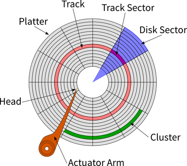

# Block Driver (notes from Class)

block driver creates a `priority queue` first.

sectors in device (HDD or storage) 

## Schedulers
There are four differnet types of schedulers running on OS.

**for information**

`cd /sys/block/sda/queue`

`cat scheduler` ==> It will give the available scheduler

## register and unregister block driver

`register_blkdev(majorno, DEVNAME);`

`unregister_blkdev(majorno, DEVNAME);`

`cat /proc/devices`

## Struct dev
`SBULL`: Simple block utility for loading localities

The `sbull` device is described by an internal structure:

```
struct Dev 
{
 		int size;						/* Device size in sectors */
 		u8 *data;					/* The data array */
 		short users;					/* How many users */
 		short media_change;		       /* Flag a media change? */
 		spinlock_t lock;			       /* For mutual exclusion */
 		struct request_queue *queue;  /* The device request queue *	/
 		struct gendisk *gd;		       /* The gendisk structure */
 		struct timer_list timer;	               /* For simulated media changes */
}
```

**vmalloc**

* allocating