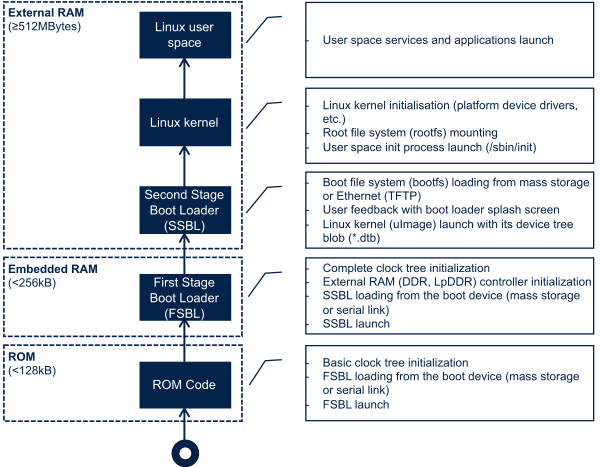
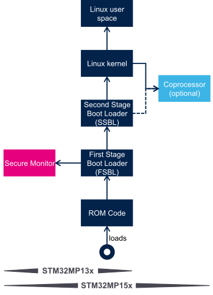

# Boot Chain Overview
(This is based on the docs from STM32 website)
https://wiki.st.com/stm32mpu/wiki/Boot_chain_overview

## Generic Boot Sequence

### 1. Linux start-up
Following diagram shows the steps to initialize the platform peripherals and memories

#### ROM code
The ROM code is a piece of software that takes its name from the read only memory (ROM) where it is stored. It fits in a few `tens of Kbytes` and maps its data in `embedded RAM`. It is the first code executed by the processor, and it embeds all the logic needed to select the `boot device (serial link or flash)` from which the `first-stage bootloader (FSBL)` is loaded to the embedded RAM.

Most products require to trust the application that is running on the device and the ROM code is the first link in the chain of trust that must be established across all started components: this trust is established by `authenticating the FSBL` before starting it. In turn, the FSBL and each following component authenticates the next one, up to a level defined by the product manufacturer.

#### First stage bootloader (FSBL)
Among other things, the `first stage bootloader (FSBL)` initializes (part of) the clock tree and the `external RAM controller`. Finally, the FSBL loads the `second-stage bootloader (SSBL)` into the external RAM and jumps to it.

The `Trusted Firmware-A (TF-A BL2)` is FSBL for Cortex-A developed by TrustedFirmware.org community.

#### 1.5 stage bootloader
(from chatgpt) A `1.5 stage bootloader` is a term sometimes used to describe a hybrid bootloader configuration that combines aspects of both a first-stage bootloader (also known as a primary bootloader) and a second-stage bootloader (also known as a secondary bootloader or a full bootloader).

In this context, the term "1.5 stage" implies that there is a primary bootloader responsible for initializing the hardware and loading a smaller, more specialized second-stage bootloader, which in turn is responsible for loading the main operating system or kernel.

This approach is often used in embedded systems where the primary bootloader is limited in size or functionality, so a secondary bootloader is used to handle more complex tasks such as loading a kernel from a filesystem. This allows for a more modular and flexible bootloader design, where the primary bootloader can be kept simple and lightweight, while the secondary bootloader can handle more advanced boot procedures.

#### Second-stage bootloader (SSBL)
The second-stage bootloader (SSBL) runs in a wide RAM so it can implement complex features (such as, USB, Ethernet, display), that are very useful to make Linux kernel loading more flexible (from a storage device on USB or on a network), and user-friendly (by showing a splash screen to the user). [U-Boot](./uboot.md) is commonly used as a Linux bootloader in embedded systems.

#### Linux kernel space
The `Linux kernel`is started in the external memory and it initializes all the peripheral drivers that are needed on the platform.

#### Linux user space
Finally, the Linux kernel hands control to the user space starting the init process that runs all initialization actions described in the root file system (rootfs), including the application framework that exposes the user interface (UI) to the user.

### 2. Other Services Start UP

In addition to  Linux  startup, the boot chain also installs the secure monitor and may support coprocessor firmware loading.

For instance, for the STM32MP15, the boot chain starts:

* The  secure monitor , supported by the Arm® Cortex®-A secure context (TrustZone). Examples of use of a secure monitor are: user authentication, key storage, and tampering management.

* The  coprocessor  firmware, running on the Arm Cortex-M core. This can be used to offload real-time or low-power services.

The dotted lines in the diagram on the right mean that:

* The  coprocessor  can be started by the second stage bootloader (SSBL), known as “early boot”, or Linux kernel (by default).

