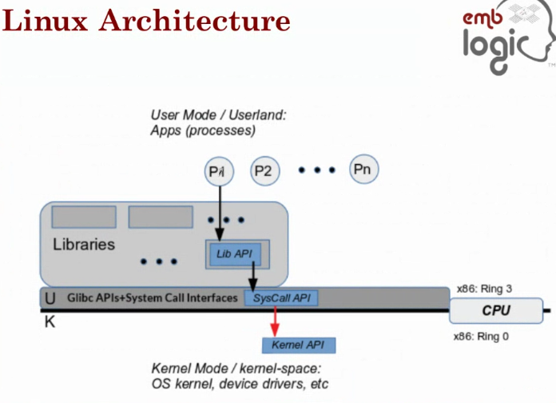
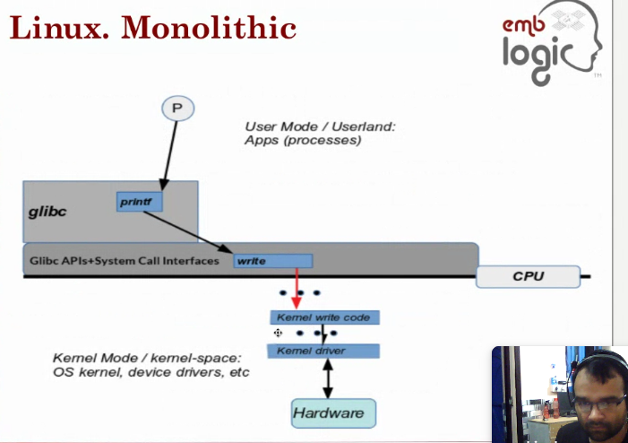

# Linux Advanced System Programming : 303

`-wall` is gcc is used to enable all warnings

`strace` trace all the system calls.

e.g. `strace <file-to-run or command>`

`objdump --source <binary-file-name>` : it gives the assembly view of the file. 

e.g. `objdump --source ./hello`

## CPU Privilege levels

* Supervisor
* User

## Linux Architecture

* Applications
* Libraries
* glibc / system call interface (SCI)
* Operating System, Kernel Drivers etc
* Hardware Layer

### Libraries

### System Calls
they work by invoking special machine instructions that hvae the built-in ability to switch the processor mode from User to supervisor mode.

### Execution Contexts within the Kernel
* Kernel code always executes in one of two contexts
    * Process
    * Interrupt

* Process Context
    * When the calling process runs the kernel code of the system call 

* Interrupt context
 * aLWAYRS RUN IN THE KERNEL CONTEXT.
 