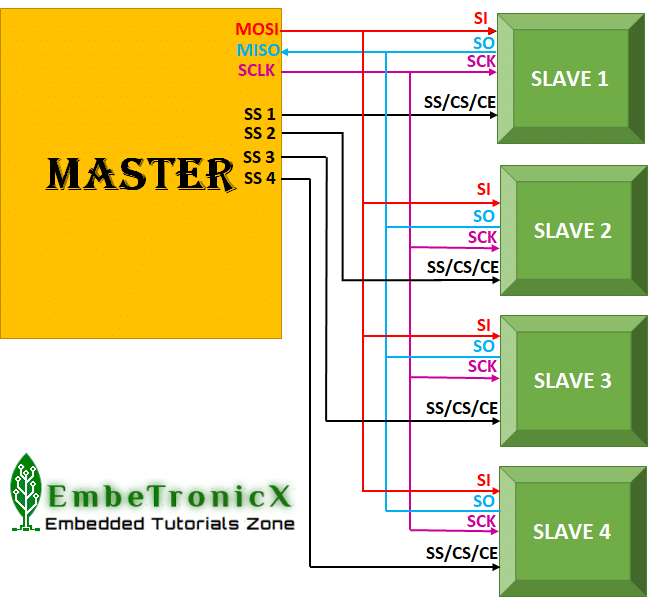

# SPI
Serial Peripheral Interface. 

It's a "synchronous" data bus, which means that it uses separate lines for data and a "clock" that keeps both sides in perfect sync. The clock is an oscillating signal that tells the receiver exactly when to sample the bits on the data line. This could be the rising (low to high) or falling (high to low) edge of the clock signal; the datasheet will specify which one to use. When the receiver detects that edge, it will immediately look at the data line to read the next bit (see the arrows in the below diagram). Because the clock is sent along with the data, specifying the speed isn't important, although devices will have a top speed at which they can operate

## How it works:
1. It uses a master-slave architecture, where a single device (the master) controls the communication with one or more slave devices. 
2. Data transmission is synchronous, meaning that both the master and slave devices use a common clock signal to synchronize data transfer. 
3. It's a full-duplex protocol, meaning that data can be transmitted in both directions simultaneously. 
4. the `CS (Chip Select)` pin, also known as `Slave Select (SS)`, is used to select a specific device (slave) from multiple devices connected to the same SPI bus, enabling communication with only the selected device. 
    * `Multiple Devices`: When multiple devices share the same SPI bus (MISO, MOSI, and SCK lines), each device needs a unique CS pin to be individually addressed. 

## different SPI modes
SPI (Serial Peripheral Interface) has 4 different modes, determined by two parameters:

1. Clock Polarity (CPOL) → Determines whether the clock (SCK) starts at low (0) or high (1).
2. Clock Phase (CPHA) → Determines when data is sampled (on the leading or trailing clock edge).

### SPI Mode Table

Mode	|CPOL	|CPHA	|Clock Idle State|	Data Sampling Edge	|Data Setup Edge
---|---|---|---|---|---
Mode 0|	0	|0	|Low (0)	|Rising edge	|Falling edge
Mode 1	|0	|1	|Low (0)	|Falling edge|	Rising edge
Mode 2|	1	|0	|High (1)	|Falling edge	|Rising edge
Mode 3|	1	|1	|High (1)	|Rising edge	|Falling edge

## is LSB or MSB transferred first in SPI

