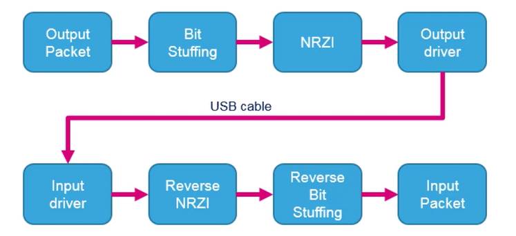
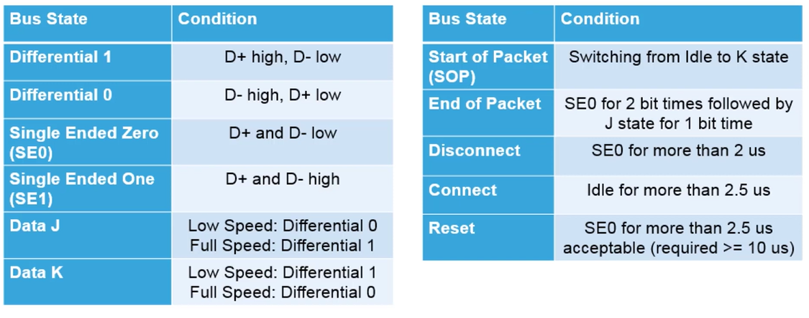
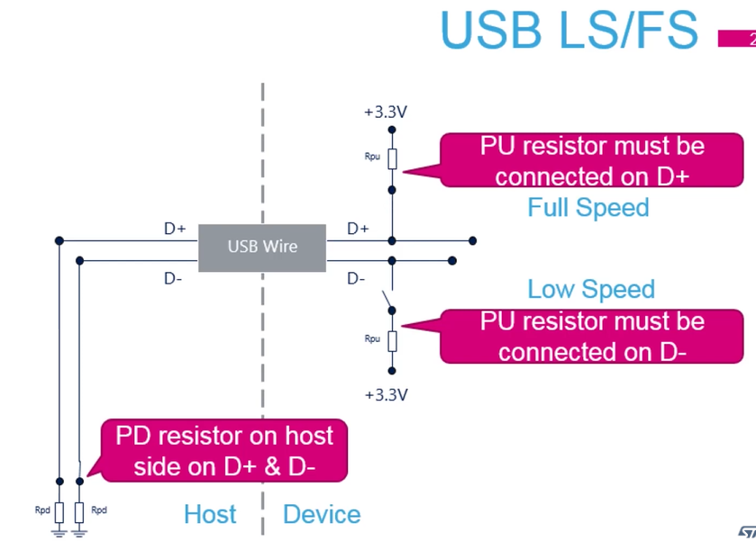
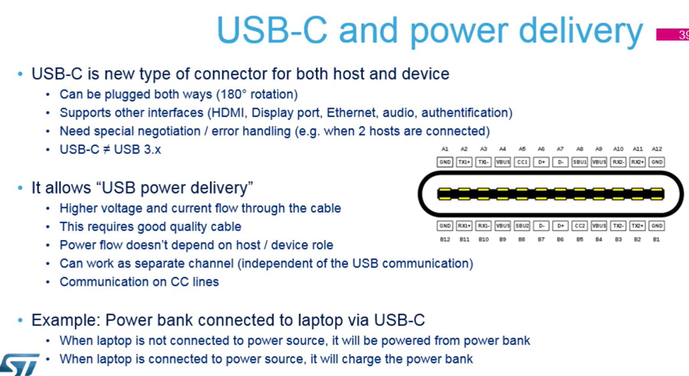
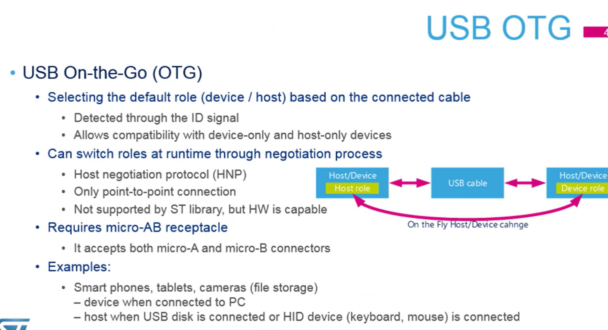

# USB Driver
This folder contains the USB driver code for bare metal on STM32 microcontroller.

Much of the information was taken from the STM32 Mooc Course form the following link:

`https://www.youtube.com/watch?v=rI3yBmnfAZU&list=PLnMKNibPkDnFFRBVD206EfnnHhQZI4Hxa&index=1`

`https://wiki.st.com/stm32mcu/wiki/Introduction_to_USB_with_STM32`

## USB Intorduction
`USB: Universal Serial Bus`

* `protocol`: Serial, Pooled, host centric
* `Max Devices`: 127
* `Pins`: 4-5 (USB 2.0),
    1-supply, 2 data, 1 groud, (optional ID signal)
* `Topology`: Tired star
    * The usb connects USB device with the `USB host`
    * `hub` is at the center of each star. Each wire segment is a `point-to-point` connection.
    * The max 127 devices can be connected
        * Each device has 7-bit address
        * Address 0 reserved for not enumerated devices
    * The max **5 hubs** can be connected in series
    * The max number of tiers allowed is `seven`
    * The max cable length is `5 meter`

### Physical Layer Flow

* Packed is coded to `NRZI` (Non-return to zero inverted) with Bit Stuffing.
    * `Bit Stuffing`: insert `0` after six consecutive `1`
* Then is send over differential bus

### Timing

* for hosts, hubs and hig-speed capable functions (=USB device) required data-rate accuracy when transmitting at any speed is +/- 0.05% (500ppm)
* for full-speed only functions required data-rate when transmitting is 12Mb/s +/- 0.25% (2500 ppm)
* Clock accuracy is very strict for USB
    * If no advance solution for `clock synchronization` (e.g. clock recovery system) is supported by the MCU, HSE usage is mandatory.

### Measuring Signal quality

* `USBET20 PC tool`: from www.usb.org
* Loads CSV file with signals

## USB Bus States

## USB LS/FS
LS: low speed, FS: full speed

for low speed pull up at `D-` and for high speed pull up at `D+`

more to hardware.

**LS Idle**

**FS Idle**

**J-State (FS)**

**K-State (FS)**

**Connect**

**Reset**

## Switching to High-Speed (HS)
we either connect at LS or FS. It is complex, hardware wise to switching to `High-Speed` 

* `HS` uses different signaling than FS/LS.
* Special chirp handshake done during USB reset.
* Every HS device must support FS communication

## USB-C and power delivery
* `USB-C` is new type of connector for both host and device.
    * can be plugged both ways (180 rotation)
    * Supports other interfaces (HDMI, Display Port, Ethernet, Audio, Authentification)
    * Need special negotiation/error handling
    * USB-C is not equal to USB 3.x

## USB OTG

